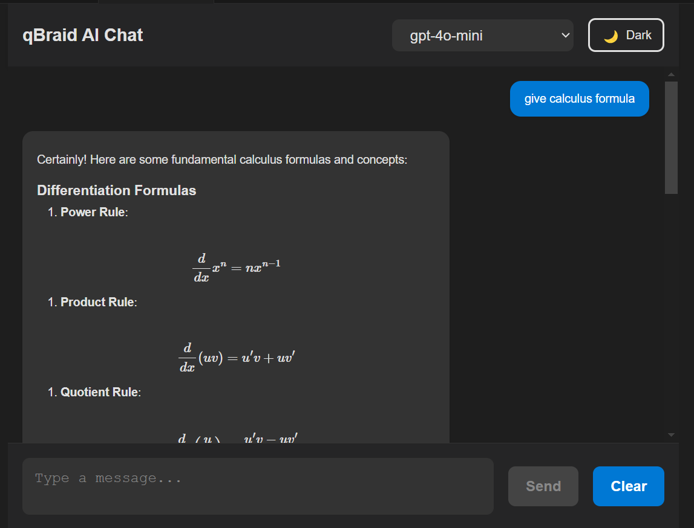

**qBraid Chat Extension for VS Code**

This is my submission for the qBraid Coding Challenge, where I built a VS Code extension that allows users to interact with the qBraid REST API through a chat interface. The extension supports sending messages, selecting AI models, and streaming responses back to the user.

*Installation*
To install and use this extension, follow these steps:

1. Install dependencies
npm install

2. Package the extension
npm run vsce:package

3. Install the extension in VS Code
code --install-extension qbraid-chat-0.1.0.vsix

*Usage*
1. Open VS Code and press Ctrl+Shift+P (Windows/Linux) or Cmd+Shift+P (Mac).
2. Search for "Start qBraid Chat" and select it.
3. Enter your qBraid API Key when prompted.
4. Choose a model from the dropdown.
5. Type a message and click "Send" to get a response.

*Features*
✅ Authenticate with qBraid API using an API key
✅ Send messages and receive responses in real-time
✅ Stream responses dynamically into the chat UI
✅ Select from available qBraid AI models
✅ Clean and intuitive UI

*Development*

Prerequisites
- Node.js
- VS Code
- VSCE (Visual Studio Code Extension Tool)

Running in Development Mode
1. Open the project in VS Code.
2. Start the extension in a new VS Code window:
npm run compile
code .
3. Press F5 in VS Code to launch a new Extension Development Host.
4. In the new window, run "Start qBraid Chat" from the command palette.

*Future improvements*

- Better error handling for invalid API keys or network failures.
- Enhancing UI/UX with better message formatting and themes.
- Adding persistent API key storage to avoid re-entering it every time.
- Extend the chat functionality to handle real-time server requests to other qBraid API endpoints to answer platform-specific questions

